# Vida Immobilien — Cinematic View

Dokumentation des scroll-gesteuerten Video-Erlebnisses in `immersive-site/`.  
Stand: Juli 2026.

---

## Konzept

Statt einer klassischen Landingpage führt der Besucher eine **cinematic Journey** durch das Vida-Immobilien-Haus. Scrollen ersetzt Play/Pause: Die Kamera bewegt sich vorwärts, Tore öffnen sich, Räume werden sichtbar — bis zum Whiteboard-Endframe, auf dem später Inserate erscheinen sollen.

**Kernidee:** Scroll = Zeitachse. Ein sticky Viewport zeigt das Video; der Scroll-Abstand bestimmt `currentTime`.

---

## Architektur

```
page.tsx
  └── ImmersiveExperience.tsx     ← Scroll-Engine + Video-Scrubbing
        ├── motion.ts             ← Progress → Phasen / Räume
        ├── rooms.ts              ← Foyer, Kaufberatung, Verkauf
        ├── tokens.ts             ← Brand-Farben, Typo, Motion
        └── AnalyticsBeacon.tsx   ← CustomEvent „vida:room-change“
```

### Scroll-Video-Engine — durchgehendes GSAP-Pin-Scrubbing

Datei: `src/components/experience/ImmersiveExperience.tsx`

Die komplette Journey (K01 → K18, alle drei Clips) wird **in einem Zug
durchgängig gescrubt**. Der Video-Viewport wird per GSAP **ScrollTrigger
gepinnt**; während der gepinnten Strecke bestimmt der Scroll-Fortschritt
`0…1` linear die kumulierte Video-Zeit über alle Clips. Danach löst sich
der Pin und die restliche Homepage scrollt normal weiter.

Smooth-Scrolling liefert **Lenis** (`src/components/experience/SmoothScroll.tsx`),
synchronisiert mit ScrollTrigger für das „buttery" Momentum-Gefühl.

| Konstante / Setting | Wert | Bedeutung |
|-----------|------|-----------|
| `SCRUB_VH_PER_SECOND` | `62` | Scroll-Weg pro Sekunde Videomaterial (vh). Höher = langsameres Scrubbing |
| `scrub` (ScrollTrigger) | `0.6` | Trägheit/Smoothing des Scrubbings |
| `pin` / `pinSpacing` | an | Erzeugt die gepinnte Scroll-Länge automatisch |

**Ablauf:**

1. Video-Metadaten (Dauer) laden → `totalUsable` (Summe nutzbarer Clip-Sekunden)
2. ScrollTrigger pinnt den Viewport; Länge = `totalUsable × SCRUB_VH_PER_SECOND`
3. `onUpdate`: globaler Progress `0…1` → kumulierte Zeit → passender Clip + `currentTime`
4. Overlay (`ExperienceOverlay`) reagiert direkt auf `progress` — Intro,
   Raum-Panels (Kaufberatung/Verkauf) und Endframe-CTA blenden zeitgerecht ein

> Hinweis: Das frühere „Snap-Sprung"-Verhalten (3 Sections mit gesperrtem
> Scroll) wurde bewusst entfernt — es führte dazu, dass die Journey nach
> Video 1 abbrach. Jetzt läuft die gesamte Fahrt flüssig durch.

---

## Video-Timeline

| # | Asset | Dauer | Usable | Szene |
|---|-------|-------|--------|-------|
| 1 | `VIDA_LOBBY_V2_SCROLL.mp4` | 10,0 s | **9,6 s** | Eingang / Foyer — Tore öffnen sich, Kamera fährt ins Haus |
| 2 | `hf_20260515_190916_…_SCROLL.mp4` | 8,04 s | **8,04 s** | Durchgang — Logo-Wand, Lounge, Übergang ins Penthouse |
| 3 | `hf_20260528_223739_…_SCROLL.mp4` | 10,04 s | **10,04 s** | Büro / Whiteboard — Penthouse, Korridor, leerer Screen (Endframe) |

**Gesamt usable:** ~27,68 s  
**Technik:** 1920×1080, 24 fps, Keyframes alle 0,25 s (optimal für Scroll-Scrubbing)

Original-Clips (ohne `_SCROLL`-Suffix) liegen ebenfalls in `public/assets/` als Master-Exporte.

---

## Scroll-Progress → Video-Mapping

| Scroll-Progress | Kumul. Zeit | Aktiver Clip | UI-Phase (`motion.ts`) |
|-----------------|-------------|--------------|------------------------|
| 0,00 – 0,35 | 0 – 9,6 s | Video 1 | `gate` → `approach` |
| 0,35 – 0,64 | 9,6 – 17,6 s | Video 2 | `approach` → `tour` |
| 0,64 – 1,00 | 17,6 – 27,7 s | Video 3 | `tour` → Whiteboard |

### Phasen-Parameter (`deriveExperienceState`)

Datei: `src/lib/experience/motion.ts`

| Signal | Progress-Bereich | Beschreibung |
|--------|------------------|--------------|
| `gateOpen` | 0,02 – 0,32 | Tore öffnen (CSS-Overlay / Logo-Fade) |
| `cameraPush` | 0,20 – 0,65 | Kamera fährt ins Gebäude |
| `landingReveal` | 0,58 – 0,90 | Landing / Service-Kacheln einblenden |
| `stage: "gate"` | < 0,33 | Eingang |
| `stage: "approach"` | 0,33 – 0,66 | Foyer / Annäherung |
| `stage: "tour"` | > 0,66 | Raum-Tour / Whiteboard |

### Raum-Zuordnung (`rooms.ts`)

| Progress | `activeRoom` | Inhalt |
|----------|--------------|--------|
| ≤ 0,74 | `foyer` | Willkommen, zentrale Drehscheibe |
| 0,74 – 0,87 | `leftRoom` | Kaufberatung — Suchprofil, Begleitung |
| > 0,87 | `rightRoom` | Verkauf & Bewertung — Whiteboard-Inserate |

---

## Key Frames — Ordner & Screenshots

Alle 18 Key-Frame-Screenshots liegen in **einem Ordner**:

```
immersive-site/public/assets/cinematic-keyframes/
```

| Datei | Key Frame |
|-------|-----------|
| `K01-tore-geschlossen.jpg` | K1 |
| `K02-tore-oeffnen.jpg` | K2 |
| `K03-logo-reveal.jpg` | K3 |
| `K04-durchfahrt.jpg` | K4 |
| `K05-foyer-totale.jpg` | K5 |
| `K06-foyer-ende.jpg` | K6 |
| `K07-clip2-start.jpg` | K7 |
| `K08-logo-wand.jpg` | K8 |
| `K09-lounge-schraeg.jpg` | K9 |
| `K10-logo-closeup.jpg` | K10 |
| `K11-penthouse-frauenkirche.jpg` | K11 |
| `K12-clip2-ende.jpg` | K12 |
| `K13-clip3-start.jpg` | K13 |
| `K14-person-am-fenster.jpg` | K14 |
| `K15-korridor.jpg` | K15 |
| `K16-whiteboard-rahmen.jpg` | K16 |
| `K17-whiteboard-totale.jpg` | K17 |
| `K18-endframe.jpg` | K18 |

Lokal im Browser: `http://localhost:3000/assets/cinematic-keyframes/K01-tore-geschlossen.jpg`

---

## Key Frames (inhaltlich)

Die wichtigsten visuellen Ankerpunkte der drei Clips — mit Timestamp, Scroll-Progress, Screenshot und UI-Aktion.

### Video 1 — Eingang / Foyer (`VIDA_LOBBY_V2_SCROLL.mp4`)

> Usable startet bei **0,4 s** (Skip). Alle Zeiten unten = Position im usable-Bereich.

| # | Screenshot | Usable-Zeit | Video-Zeit | Scroll % | Beschreibung | UI-Empfehlung |
|---|------------|-------------|------------|----------|--------------|---------------|
| **K1** | 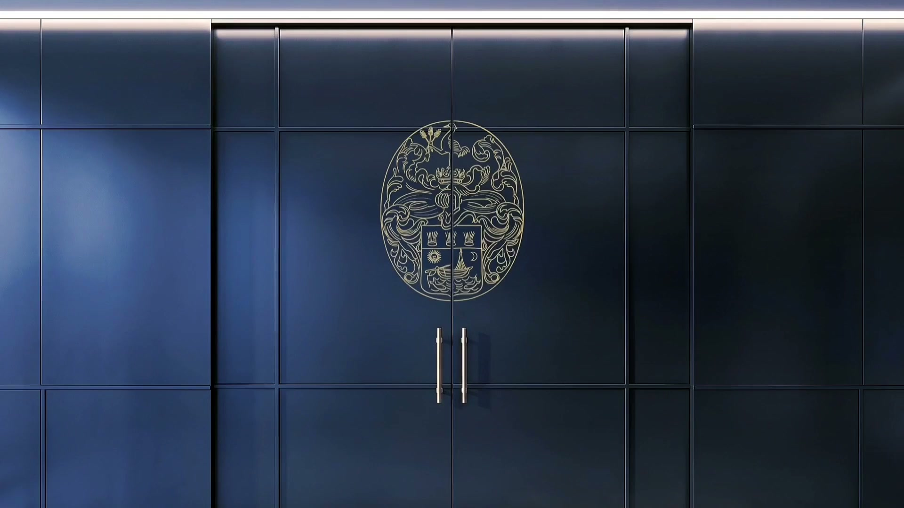 | 0,0 s | 0,4 s | ~0 % | Geschlossene navyblaue Doppeltür mit goldenem Wappen | Logo-Plakette voll sichtbar |
| **K2** | 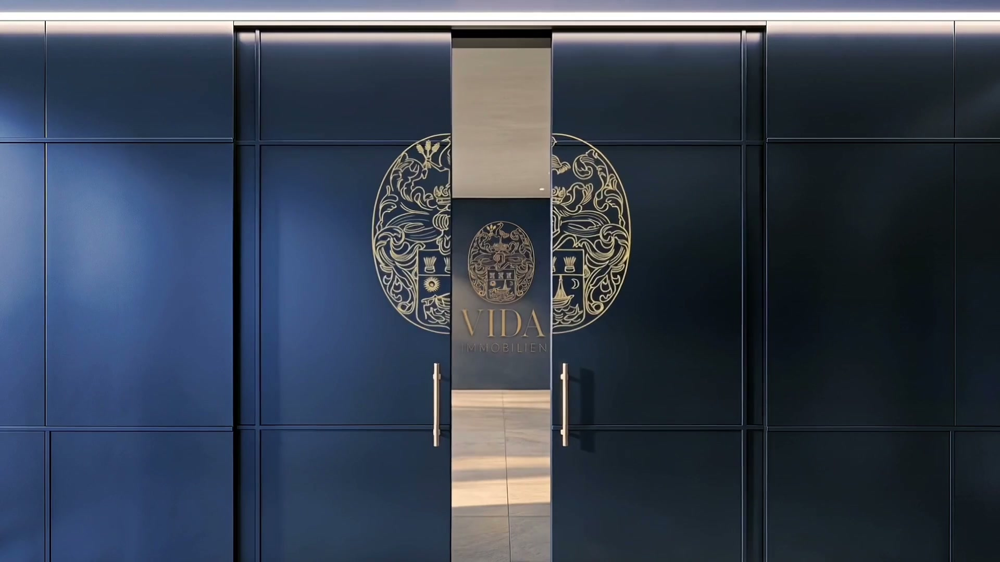 | 1,5 s | 1,9 s | ~5 % | Tore beginnen sich zu öffnen | `gateOpen` startet |
| **K3** | 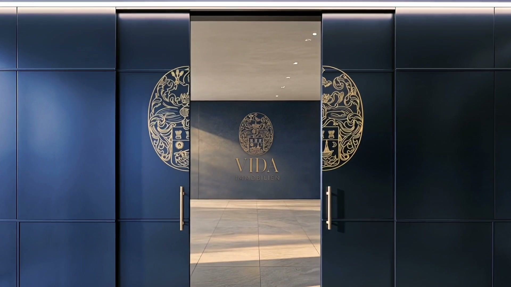 | 2,5 s | 2,9 s | ~9 % | Tore halb offen — VIDA-Logo sichtbar | Scroll-Hinweis, Reveal-Moment |
| **K4** | 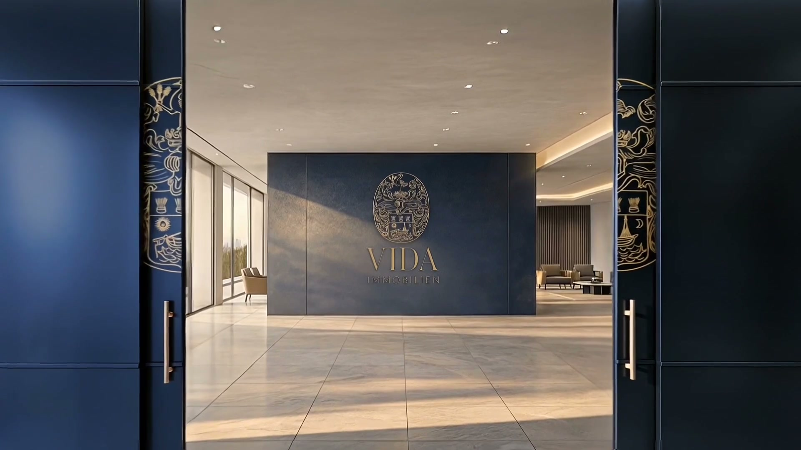 | 4,0 s | 4,4 s | ~14 % | Kamera fährt durch offene Tore | `cameraPush` aktiv |
| **K5** | 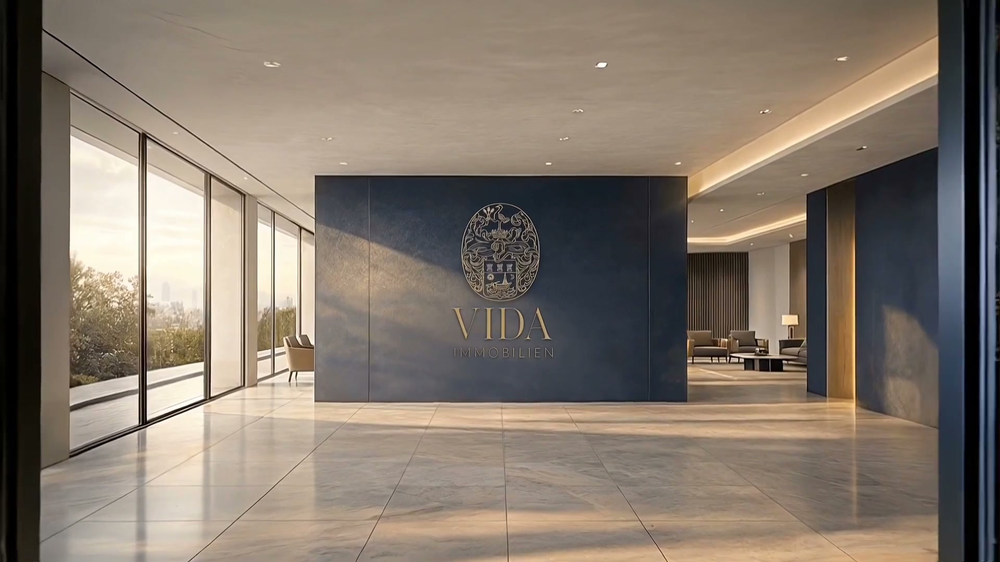 | 6,0 s | 6,4 s | ~22 % | Totale Foyer mit Logo-Wand | Foyer-Intro, Service-Kacheln |
| **K6** | 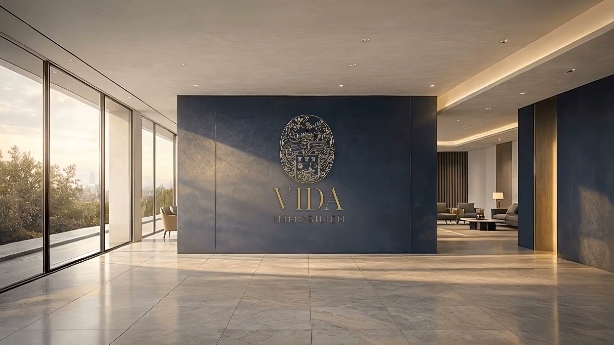 | 9,6 s | 9,75 s | ~35 % | Weitwinkel-Foyer, Golden Hour | Übergang zu Video 2 |

---

### Video 2 — Durchgang / Penthouse (`hf_20260515_…_SCROLL.mp4`)

| # | Screenshot | Clip-Zeit | Scroll % | Beschreibung | UI-Empfehlung |
|---|------------|-----------|----------|--------------|---------------|
| **K7** |  | 0,0 s | ~35 % | Anschluss an Foyer — Logo-Wand | Nahtloser Clip-Wechsel |
| **K8** | 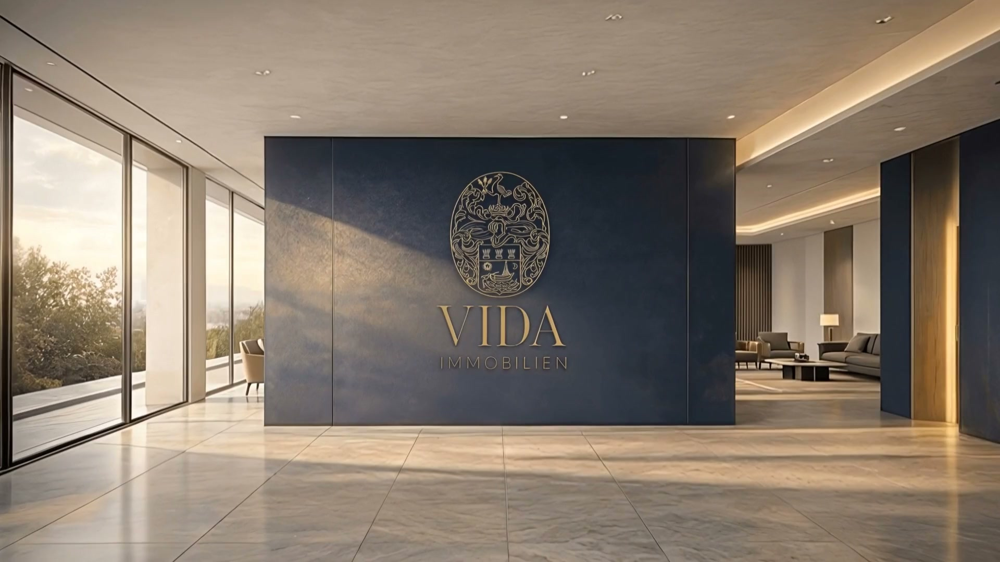 | 2,0 s | ~42 % | Totale Logo-Wand, Terrassenblick | Service-Kacheln |
| **K9** | 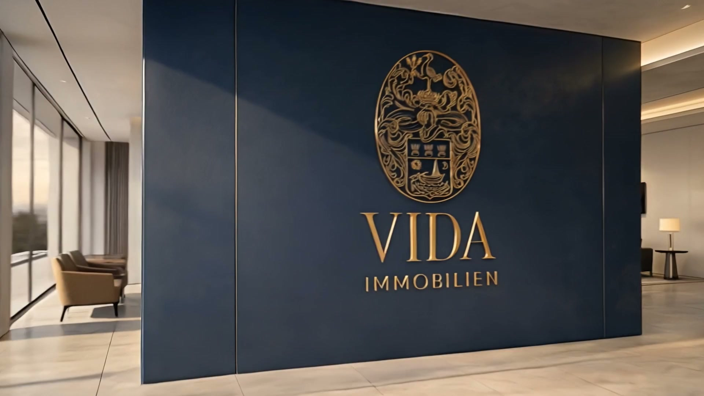 | 4,0 s | ~49 % | Schräge Ansicht Lounge / Logo | `cameraPush` Peak |
| **K10** | 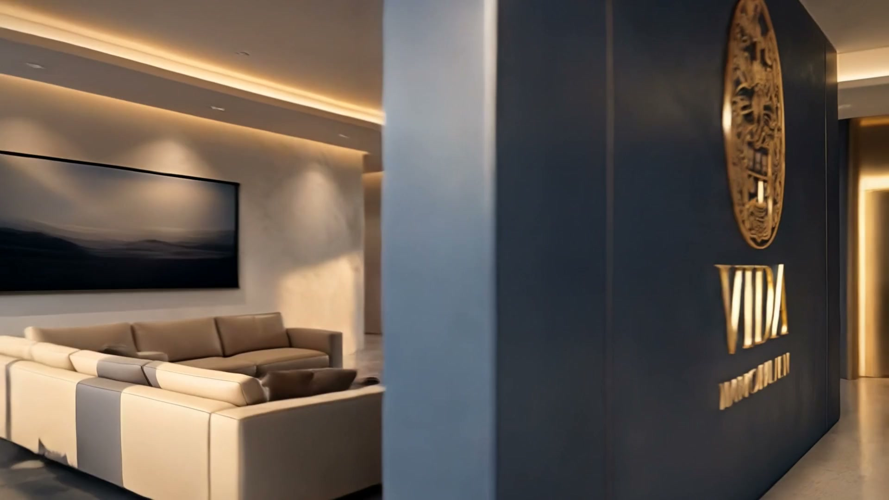 | 5,0 s | ~53 % | Close-up VIDA-Wappen | Brand-Moment |
| **K11** | 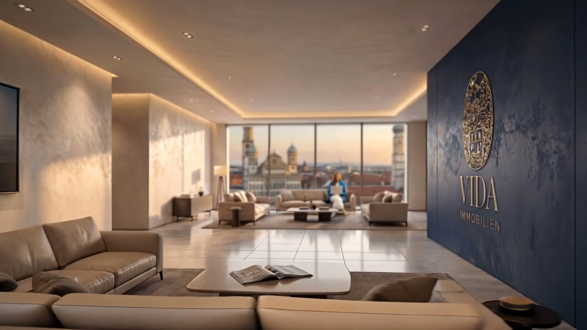 | 6,0 s | ~56 % | Penthouse, Frauenkirche im Fenster | Übergang zu „Tour“ |
| **K12** |  | 7,75 s | ~64 % | Penthouse mit Person, VIDA-Wand | Vorbereitung Video 3 |

---

### Video 3 — Korridor / Whiteboard-Endframe (`hf_20260528_…_SCROLL.mp4`)

| # | Screenshot | Clip-Zeit | Scroll % | Beschreibung | UI-Empfehlung |
|---|------------|-----------|----------|--------------|---------------|
| **K13** | 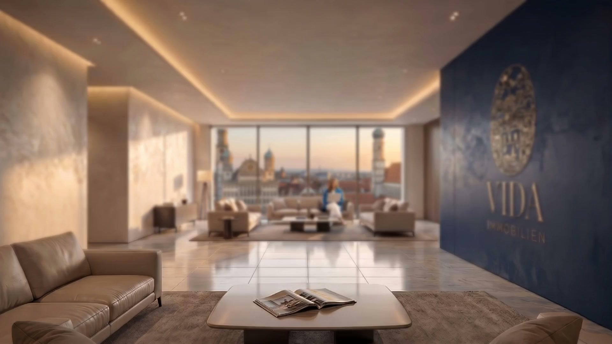 | 0,0 s | ~64 % | Penthouse mit VIDA-Branding | Tour-Start |
| **K14** | 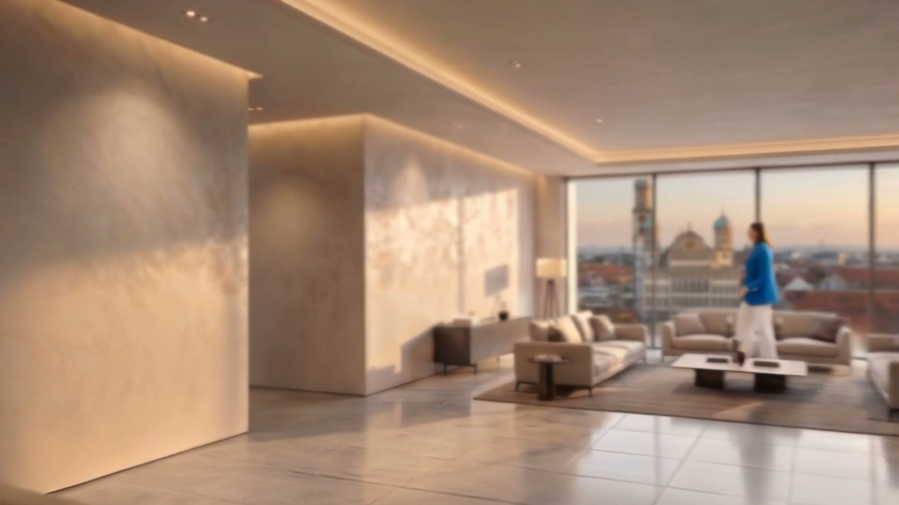 | 3,0 s | ~75 % | Person am Panoramafenster | **`leftRoom`** — Kaufberatung |
| **K15** | 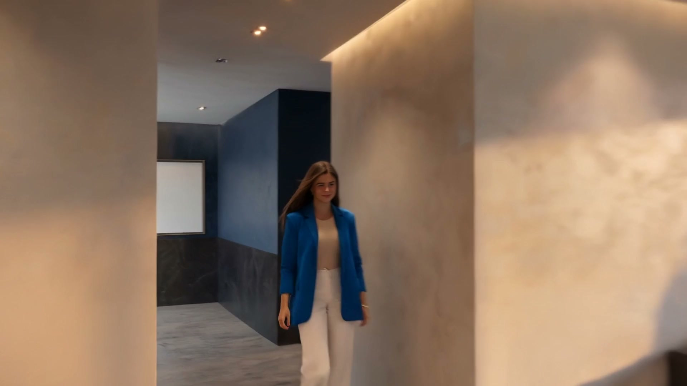 | 5,0 s | ~82 % | Korridor, Person in Blau | **`leftRoom`** Übergang |
| **K16** | 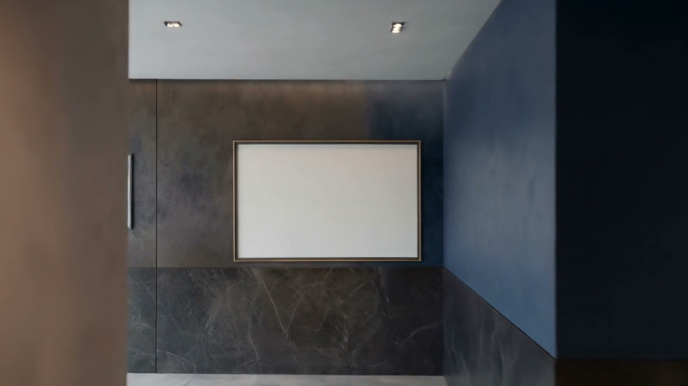 | 7,0 s | ~89 % | Leerer weißer Rahmen (Whiteboard) | **`rightRoom`** — Verkauf |
| **K17** | 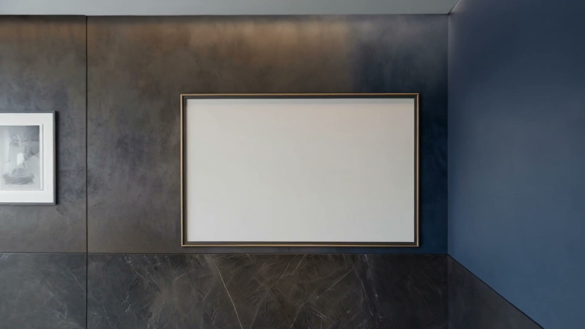 | 8,0 s | ~92 % | Rahmen zentriert, Marmor-Sockel | **Inserate platzieren** |
| **K18** | 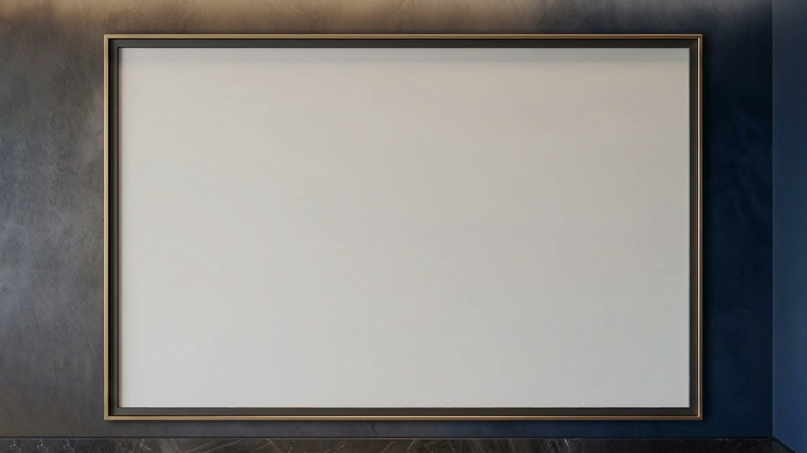 | 9,75 s | ~100 % | Endframe — leerer Screen | Kontakt, CTA, Listings |

---

## Brand & Design Tokens

Datei: `src/lib/experience/tokens.ts`

| Token | Wert | Verwendung |
|-------|------|------------|
| `royalBlue700` | `#0f2f65` | Primär, Türen, Akzentwände |
| `warmWood500` | `#7a4d2d` | Holz-Akzente (Legacy `index.html`) |
| `gold400` | `#b99862` | Logo, CTAs, Highlights |
| `stone050` | `#f6f3ee` | Hintergrund Text / Karten |
| `cinematicEase` | `cubic-bezier(0.2, 0.7, 0.2, 1)` | Alle UI-Transitions |

---

## Räume & Content-Mapping

Datei: `src/lib/experience/rooms.ts`

| Raum | Titel | CTA | Scroll-Phase |
|------|-------|-----|--------------|
| `foyer` | Foyer | Exposé anfordern → `#kontakt` | K1 – K8 |
| `leftRoom` | Kaufberatung | Suchprofil starten → `#kaufberatung` | K14 – K15 |
| `rightRoom` | Verkauf & Bewertung | Bewertung anfragen → `#verkauf` | K16 – K18 |

---

## Legacy-Referenz (`index.html`)

Im Projektroot liegt eine frühere **CSS-only Scroll-Experience** ohne Video:

1. **Gate-Phase** (0 – 34 %): Holztore öffnen sich mit 3D-Hinge
2. **Zoom-Phase** (24 – 74 %): Kamera-Push mit `scale(2.32)` + Tilt
3. **Reveal-Phase** (60 – 95 %): Landing-Karte mit 3 Service-Tiles

Die Progress-Werte in `motion.ts` (`gateOpen`, `cameraPush`, `landingReveal`) spiegeln dieses Konzept — jetzt mit echtem 3D-Video statt CSS-Hintergrund.

---

## Technische Hinweise

### Scroll-Scrubbing Performance
- Videos sind mit Keyframes alle **250 ms** encodiert → flüssiges Vor-/Zurückscrubben
- `preload="auto"` lädt alle Clips vor
- `muted` + `playsInline` für iOS-Kompatibilität

### Clip-Übergänge
- Nur ein `<video>` hat `z-index: 2` (`videoOnTop`)
- Abgeschlossene Clips werden auf `duration` gesetzt (letzter Frame bleibt stehen)
- Folge-Clips starten bei `currentTime = 0`

### Geplante Erweiterungen (aus Konzept-Docs)
- `ExperienceOverlay` — Logo, Raum-Panels, Whiteboard-Listings
- Sanity CMS — `listing` + `siteSettings` für Inserate auf K17/K18
- `ReducedMotionExperience` — Fallback ohne Scroll-Scrubbing
- Analytics via `vida:room-change` CustomEvent

---

## Quick Reference — Progress → Key Frame

```
0.00  K1   Tore geschlossen
0.05  K2   Tore öffnen
0.09  K3   Halb offen — Logo-Reveal
0.14  K4   Durchfahrt
0.22  K5   Foyer-Totale
0.35  K6/K7  Clip-Wechsel → Video 2
0.42  K8   Logo-Wand Totale
0.49  K9   Schräge Lounge-Ansicht
0.53  K10  Logo Close-up
0.56  K11  Penthouse (Frauenkirche)
0.64  K12/K13 Clip-Wechsel → Video 3
0.75  K14  Person am Fenster → leftRoom
0.82  K15  Korridor → leftRoom
0.89  K16  Whiteboard-Rahmen → rightRoom
0.92  K17  Whiteboard Totale → Inserate
1.00  K18  Endframe → Kontakt / CTA
```

---

## Dateien & Assets

```
immersive-site/
├── CINEMATIC-VIEW.md                          ← dieses Dokument
├── src/
│   ├── app/page.tsx
│   ├── components/experience/
│   │   ├── ImmersiveExperience.tsx            ← Scroll-Engine
│   │   ├── ImmersiveExperience.module.css
│   │   └── AnalyticsBeacon.tsx
│   └── lib/experience/
│       ├── motion.ts
│       ├── rooms.ts
│       └── tokens.ts
└── public/assets/
    ├── cinematic-keyframes/                   ← K01–K18 Screenshots
    │   ├── K01-tore-geschlossen.jpg
    │   ├── …
    │   └── K18-endframe.jpg
    ├── VIDA_LOBBY_V2_SCROLL.mp4               ← Video 1
    ├── hf_20260515_…_SCROLL.mp4               ← Video 2
    └── hf_20260528_…_SCROLL.mp4               ← Video 3
```
